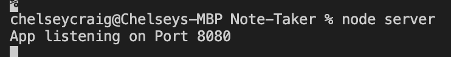
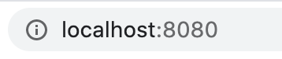
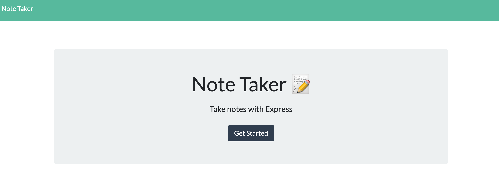
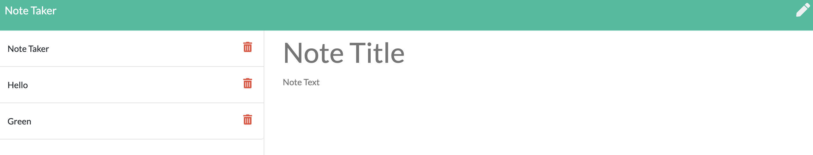
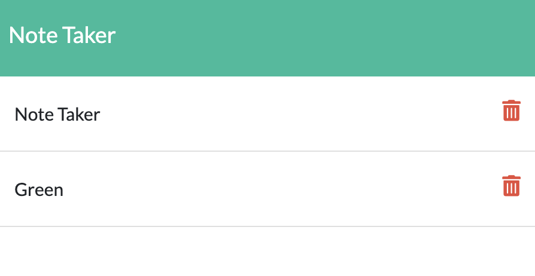

# Note-Taker

## Description

This application will allow the user to actively take notes and track his/her previous notes that were previously saved. Along with this, the user will also be able to delete notes that are no longer needed at his/her descretion.

___

## How it Works

In order for this application to work the user will need to use the terminal to run the program.  Here is where the user will be able to get the PORT information in order to get the localhost number to open in the browser. This can be done by runnning "node serve" in the command line.
  

  

From there, the user will need to navigate over to their brower and open up the local host listen port in order to view the page.

  

  

By doing this, the user will be able to view the opening page of the application. From there, he/she will be able to click on the "Get Started" button in the middle of the page. 
  

  

Once the "Get Started" button in clicked, the user will be navegated to the "notes.html" page. This is acheived by using the app.get method that sends the file from the index pages to the notes page. Here the user has the option to type in a note and save it into the on the lefthand side of the page using the app.post method along with the readfile and writefile methods found in fs pakage within node.
  

  

By adding the file, the user can view the db.json file and find that what once was an empty array, now contains the notes that have been created on the frontend as objects.
  

  

The final step the user can complete in the application is the deleting notes that he/she no longer wishes to be in the note taker application. To do this, the user will click on the red trashcan icon and the object will be removed from the db.json file. The remaining items will be displayed on the frontend.

  

  
___

### Links for Heroku Deployment and GitHubDeployment
 
Heroku: https://note-taker7.herokuapp.com/
  
GitHub: https://ccraig7321.github.io/Note-Taker/
  

### License

Copyright 2020 CHELSEY CRAIG

Permission is hereby granted, free of charge, to any person obtaining a copy of this software and associated documentation files (the "Software"), to deal in the Software without restriction, including without limitation the rights to use, copy, modify, merge, publish, distribute, sublicense, and/or sell copies of the Software, and to permit persons to whom the Software is furnished to do so, subject to the following conditions:

The above copyright notice and this permission notice shall be included in all copies or substantial portions of the Software.

THE SOFTWARE IS PROVIDED "AS IS", WITHOUT WARRANTY OF ANY KIND, EXPRESS OR IMPLIED, INCLUDING BUT NOT LIMITED TO THE WARRANTIES OF MERCHANTABILITY, FITNESS FOR A PARTICULAR PURPOSE AND NONINFRINGEMENT. IN NO EVENT SHALL THE AUTHORS OR COPYRIGHT HOLDERS BE LIABLE FOR ANY CLAIM, DAMAGES OR OTHER LIABILITY, WHETHER IN AN ACTION OF CONTRACT, TORT OR OTHERWISE, ARISING FROM, OUT OF OR IN CONNECTION WITH THE SOFTWARE OR THE USE OR OTHER DEALINGS IN THE SOFTWARE.

___